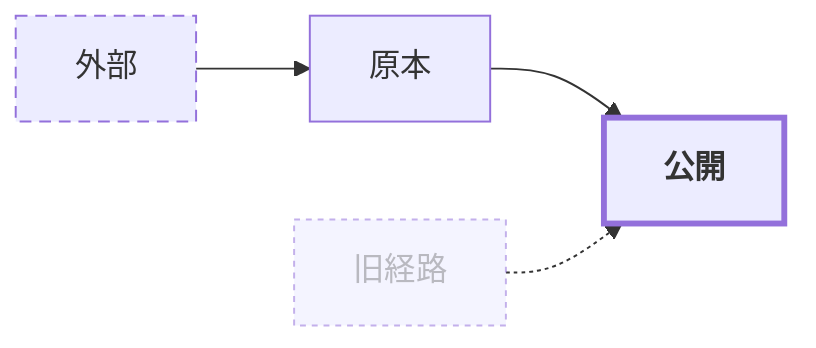

# Mermaid図解基盤

Markdown内のMermaid原本を、Docusaurus / Slidevではネイティブ描画し、Pandoc / Marpでは同じ原本から生成したSVGとして利用するための共通基盤です。

## まず使う

```bash
cd diagrams
npm install
npm run build
npm run check
```

個別の`.mmd`をSVG化する場合は、出力先とテーマを明示します。

```bash
npm run render -- samples/flowchart.mmd generated/neutral/flowchart.svg --theme neutral
npm run render -- samples/flowchart.mmd generated/forsteri/flowchart.svg --theme forsteri
```

ローカルChromeを自動検出します。自動検出できない環境では`MERMAID_CHROME_PATH`へ実行ファイルを指定してください。CLIに同梱されたChromiumを利用できる環境では指定不要です。

## テーマの使い分け

| テーマ | 用途 | 原本 |
|---|---|---|
| `neutral` | Docusaurusライト、Pandoc HTML/PDF | `themes/neutral.json`。Docusaurusの`custom.css`と同じ主色（ティール）・文字・面・罫線色 |
| `forsteri` | Marp、Slidev | `marp-theme/themes/forsteri/forsteri.css`のMarp共有トークンから生成 |

`forsteri.json`は生成物です。直接編集せず、Marp共有トークンを更新して`npm run build:themes`を実行します。図表系列は系列色 series-1〜8 を`cScale0`〜`cScale7`、`fillType0`〜`fillType7`、`git0`〜`git7`、`pie1`〜`pie8`へ割り当てます。

Docusaurusのダークモードは組み込み`dark`テーマを使います。`base + neutral themeVariables`をそのまま暗背景へ載せると明るい面色が残るためです。図単位で色を固定しない限り、ライトはneutral、ダークはMermaid組み込みdarkへ自動切替されます。

## 図種を選ぶ

| 図種 | 適する内容 | 避ける内容 |
|---|---|---|
| `flowchart` | 処理、判断、依存、データフロー | 時系列の会話 |
| `sequenceDiagram` | API呼び出し、利用者とシステムの時系列 | 組織・静的構成 |
| `stateDiagram-v2` | 状態と遷移、ライフサイクル | 多数要素のネットワーク |
| `architecture-beta` | クラウドサービスを含む構成図 | 厳密な物理配置、公式SVGの自由組版 |

`architecture-beta`は実験的構文です。複雑な配置や公式図形ルールが必要な構成図は、この基盤の対象外であるSVG組版フローを使います。

## 定型classDef

色はテーマが決めます。クラスは意味に必要な差分だけを指定し、色値を直書きしません。



- `emphasis`: 結論、主要経路、注目対象。1図につき1〜2要素まで。
- `external`: 管理境界の外側にある人・システム。
- `deprecated`: 廃止予定または移行元。現行経路と混同しないために使う。

## 図単位の上書き

例外が必要な図だけ、先頭のconfigフロントマターを使います。共有テーマを置き換えず、レイアウトや間隔の調整に限定してください。

```text
---
config:
  flowchart:
    curve: linear
    nodeSpacing: 36
---
flowchart LR
  A --> B
```

古い`%%{init: ...}%%`も動作しますが、新規作成ではconfigフロントマターを優先します。どちらの場合もブランド色・フォント・AWSアイコンprefixを上書きしません。

## 原本管理

- 図は使うMarkdownのMermaidコードブロックへ直書きするのが基本です。
- 複数形式で同じ図を受入確認する場合や、複数文書で再利用する場合だけ`samples/*.mmd`へ置きます。
- Pandoc / Marp向けSVGは`generated/<theme>/`へ生成し、`.mmd`と同名にします。
- SVGを直接修正しません。変更はMarkdownまたは`.mmd`へ戻して再生成します。

## Agent向け生成ガイド

1. 図で伝える判断を1文にし、適切な図種を選ぶ。
2. ラベルは名詞または短い動詞句にし、1ノード2行程度までにする。
3. 方向は原則`LR`、工程数が多い場合だけ`TD`を使う。
4. 色を直書きせず、強調・外部・廃止は定型classDefで表す。
5. AWSは`manifest.json`で名前を検索し、`aws:<icon-name>`を指定する。
6. `npm run check`で両テーマ・全サンプルを描画してから文書をビルドする。

## AWSアイコン

2026 Q3のAWS公式パッケージから、Service 64サイズとResource 48サイズのSVGを全カテゴリ取り込んでいます。`scripts/build-aws-pack.mjs`が次を生成します。

- `assets/aws/2026-q3/manifest.json`: Mermaid名から公式SVGパス・カテゴリ・種別への対応
- `assets/aws/2026-q3/aws-iconify.json`: prefix `aws`のIconify JSONパック

例:


DocusaurusとSlidevは起動時にパックを登録します。Mermaid CLI 11.16.0の`--iconPacks`はnpmパッケージ名を前提とし、ローカルJSONを直接受け取りません。`render.mjs`はローカルだけで一時HTTPサーバを立て、`--iconPacksNamesAndUrls`へ渡して事前レンダリングします。外部ネットワークは不要です。アイコン登録を制御できないGitHub等のMermaidレンダラでは`?`になるため、`generated/`のSVGを埋め込んでください。

## 固定バージョン

| 環境 | Mermaid |
|---|---|
| Docusaurus 3.10.2 / theme-mermaid | 11.17.2 |
| Slidev 52.19.1 | 11.17.2 |
| mermaid-cli 11.16.0 | 11.17.2 |

描画差が出たときは、まずこの3系統のバージョン差と`architecture-beta`の対応状況を確認します。
