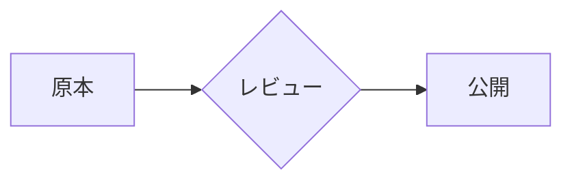

# 図解基盤の使い方

Mermaidテキストを書けば、DocusaurusとSlidevではそのまま、PandocとMarpでは事前レンダリングしたSVGとして、**4形式すべてで同じ見た目のテーマ準拠の図**になります。テーマは文書系向けの`neutral`と、スライド系向けの`forsteri`の2種です。

## 最初の一歩（Docusaurus / Slidev）

Markdownの中にMermaidコードブロックを書くだけです。色は書きません。

````markdown

````

このサイトでは`neutral`テーマ（ダークモード時は組み込みdark）、Slidevでは`forsteri`テーマが自動適用されます。

## 最初の一歩（Pandoc / Marp）

ネイティブ描画されない形式では、共通レンダラでSVGを生成してから画像として参照します。

```bash
cd diagrams
npm install
npm run render -- samples/flowchart.mmd generated/neutral/flowchart.svg --theme neutral
npm run render -- samples/flowchart.mmd generated/forsteri/flowchart.svg --theme forsteri
```

Pandocには`neutral`、Marpには`forsteri`を使います。SVGは直接編集せず、`.mmd`を更新して再生成します。

## 覚えておくルール

- **色を直書きしない**: 強調・外部システム・廃止は定型classDef（`emphasis` / `external` / `deprecated`）で表します。系列の色分けが必要なときも、テーマの系列色（series-1〜8）に任せます。
- 図種は内容で選びます: 処理・判断は`flowchart`、時系列の応答は`sequenceDiagram`、状態遷移は`stateDiagram-v2`、クラウド構成図は`architecture-beta`。
- AWS構成図では公式アイコンを`aws:<icon-name>`で指定できます（2026 Q3版・818アイコン）。名前は`diagrams/assets/aws/2026-q3/manifest.json`で検索します。
- 図の原本は使う文書のMarkdownへ直書きが基本です。複数文書で使い回す図だけ`diagrams/samples/`へ置きます。
- `forsteri`テーマはMarpの共有トークンから生成します（`npm run build:themes`）。`npm run check`が`neutral`とこのサイトのCSS、`forsteri`とMarpトークンの一致を検査します。

## 詳細リファレンス

- 図種の使い分け・classDef・Agent向け生成ガイド・固定バージョン: `diagrams/README.md`
- このサイトでの実表示見本: [スタイル確認ページ](/style-check)のMermaid節
