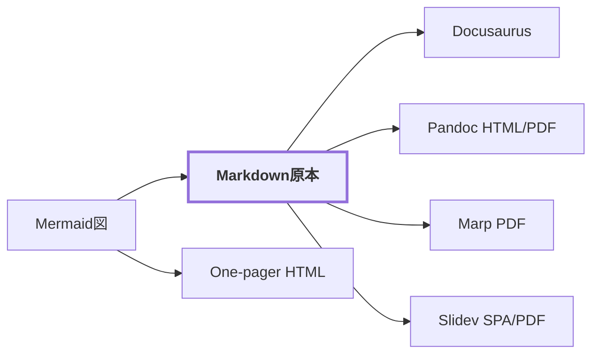

# ツールキット概要

このリポジトリ（docs-toolkit）は、技術文書とプレゼンテーションの**書き方・見せ方・作り方**をまとめたツールキットです。文書本文はMarkdownを原本とし、用途に応じて5つの出力形式と図解基盤を使い分けます。1枚資料のOne-pagerだけは、Markdownではなく用意した部品でHTMLを直接書きます。

## 構成要素

| 要素 | 用途 | 見た目 | ガイド |
| --- | --- | --- | --- |
| Docusaurus | 検索・ナビゲーション付きの継続更新ドキュメント（このサイト自身） | ニュートラル（主色はティール） | [使い方](./docusaurus) |
| Pandoc | 単体HTML / PDFとして配布する技術文書 | ニュートラル（主色はティール） | [使い方](./pandoc) |
| One-pager | 概念・方針・構造を1枚で説明する単体HTML（画面共有・Agent生成前提） | ニュートラル（文書系と同じ配色・大きな文字） | [使い方](./one-pager) |
| Marp | プレゼンテーション（PDF・人手/Agent両用） | `forsteri`テーマ | [使い方](./marp) |
| Slidev | プレゼンテーション（Webホスト・Agent前提） | `forsteri`テーマ | [使い方](./slidev) |
| 図解基盤 | Mermaid原本から全形式へ同じ見た目の図を出す共通基盤 | `neutral` / `forsteri`の2テーマ | [使い方](./diagrams) |

どの形式を選ぶかの判断基準は[文書運用](/conventions/document-policy)に、文章の書き方は[書き方](/conventions/writing-style)にまとめています。

## 設計の原則

- **内容とスタイルの分離**: 本文はMarkdown、見た目はテーマが決めます。書き手は色やレイアウトを選びません。
- **ひとつのツールキットに見える配色**: スライド系は`forsteri`テーマ、文書系はニュートラルな情報設計ですが、主色は共通のティール `#0f766e` に揃えています。
- **トークンの単一ソース**: 色・フォントの共有トークンはMarpテーマの`marp-theme/themes/forsteri/forsteri.css`が原本です。Slidevテーマ（`npm run brand:sync`）と図解基盤の`forsteri`テーマ（`npm run build:themes`）はそこから生成します。
- **シンプルな見た目**: 装飾画像は使いません。線・面・主色だけで構成します。
- **1枚なら削る**: One-pagerは「大きく、少なく、濃く」。文字を縮めず、収まらない情報を削ります。補助的な小さい文字や薄い文字色をテーマが持ちません。
- **Agentが使える形**: 図解コンポーネント・パターン集・図解規約は、Agentが構造化入力から生成できるAPIとガイドを備えています。

## バージョン

現在は**v0.1.0**です。変更履歴はリポジトリルートの`CHANGELOG.md`を参照してください。
