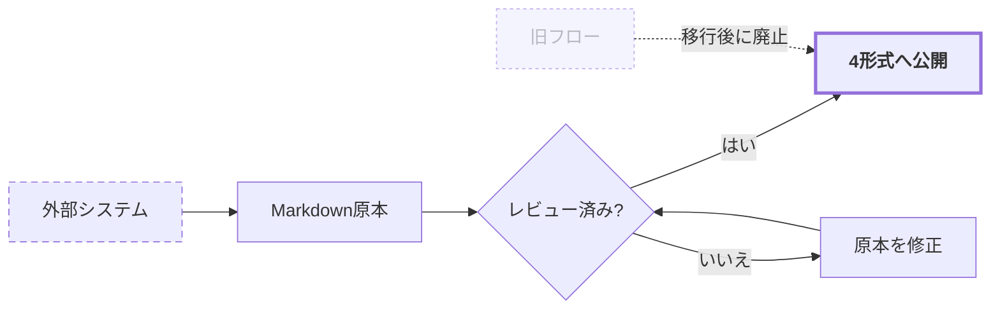
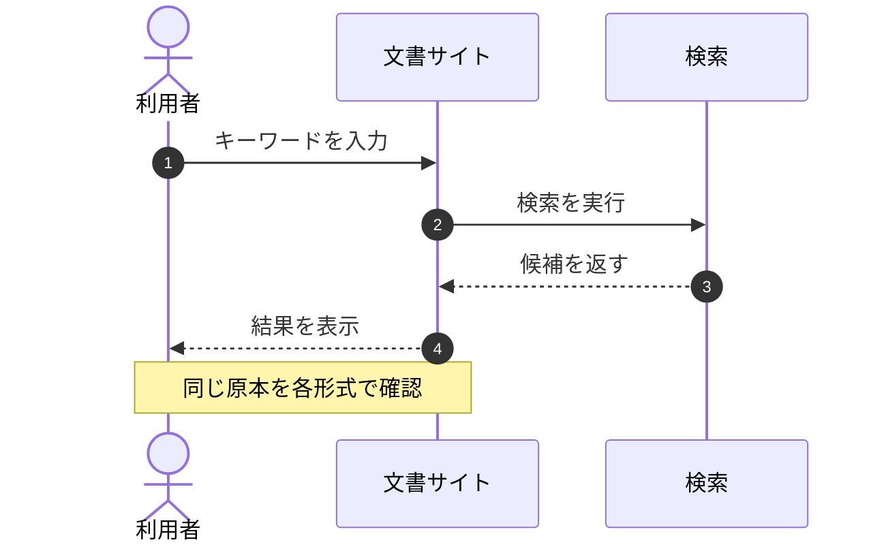

# スタイル確認

このページはテーマ調整用のサンプルです。サイドバーには表示されません（`/style-check`で直接開きます）。

## 見出しと本文

本文の標準スタイルです。読みやすさを確認するため、ある程度の長さの日本語文章を置いています。文書の完全性より、読み手が判断または作業できることを優先します。事実、判断、未決事項、確認方法を分けて記述してください。

### 第3階層の見出し

`インラインコード`と本文の組み合わせを確認します。設定値は `timeout: 30` のように表記します。英数字の場合は `docusaurus.config.js` のようになります。

## 表

| 項目 | 型 | 既定値 | 説明 |
| --- | --- | --- | --- |
| `retries` | number | `3` | 失敗時の再試行回数 |
| `timeout` | number | `30` | タイムアウト秒数 |
| `verbose` | boolean | `false` | 詳細ログの出力 |

## DocMeta

文書メタ情報コンポーネントの見本です（テンプレート冒頭で使用）。

<DocMeta
  id="DESIGN-XXX-001"
  status="Draft"
  version="0.1.0"
  updated="YYYY-MM-DD"
  owner=""
  classification="Internal"
  extra={{'関連文書': ''}}
/>

ステータスバッジの配色: <span className="doc-meta-badge doc-meta-badge--draft">Draft</span> <span className="doc-meta-badge doc-meta-badge--review">Review</span> <span className="doc-meta-badge doc-meta-badge--approved">Approved</span> <span className="doc-meta-badge doc-meta-badge--deprecated">Deprecated</span>

## 注記

:::note
補足情報を示す注記です。
:::

## カスタム注記（執筆規約対応）

:::decision
決定の注記です。採用した方式と理由に使用します。
:::

:::pending
未決の注記です。決まっていないこと、決める期限、決める人を書きます。
:::

:::assumption
前提の注記です。崩れた場合に影響が出る条件を明示します。
:::

:::decision[採用]
タイトルを置き換えた例です。
:::

:::info
参照先や背景を示す注記です。
:::

:::warning
作業前に確認が必要な注意事項です。
:::

:::danger
取り返しがつかない操作への警告です。
:::

## コードブロック

```bash title="ビルドと確認"
npm run build
npm run serve
```

```js title="docusaurus.config.js（抜粋）" {2}
const config = {
  markdown: {mermaid: true},
  themes: ['@docusaurus/theme-mermaid'],
};
```

行番号とマジックコメントの見本です。

```js showLineNumbers
function check(items) {
  // highlight-next-line
  const invalid = items.filter((item) => !item.owner);
  return invalid.length === 0;
}
```

シェルスクリプトと追加言語（HCL）の見本です。

```bash title="deploy.sh"
set -euo pipefail
environment="$(jq -r '.environment' config.json)"
echo "Deploying to ${environment}"
```

```hcl title="main.tf"
resource "aws_s3_bucket" "docs" {
  bucket = "example-docs"
}
```

## タブと折りたたみ

OS別の手順など、択一の内容はタブで書き分けます。

<Tabs>
  <TabItem value="win" label="Windows" default>

    `winget install Example.Tool` を実行します。

  </TabItem>
  <TabItem value="mac" label="macOS">

    `brew install example-tool` を実行します。

  </TabItem>
</Tabs>

長い補足は折りたたみます。

<details>
  <summary>実行ログの例（クリックで展開）</summary>

  ```text
  [INFO] build started
  [INFO] build finished in 12.3s
  ```

</details>

## Mermaid

{/* diagrams:flowchart:start */}

{/* diagrams:flowchart:end */}

{/* diagrams:sequence:start */}

{/* diagrams:sequence:end */}

{/* diagrams:architecture-aws:start */}

{/* diagrams:architecture-aws:end */}
