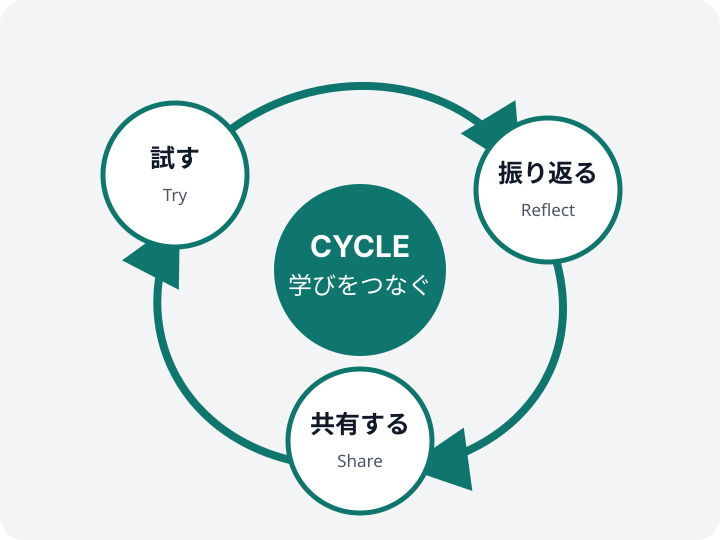

<!-- _class: dark title -->
<!-- _header: 2026.09.12｜Casual study session -->

# 生成AIを、<br>手元の小さな実験から。

## Small Experiments, Shared Learning

カジュアルな勉強会のためのNightテーマサンプル

---

<!-- _class: dark statement -->

# 勉強会の価値は、<br>正解よりも「次の問い」を持ち帰ること。

今日は、うまくいった結果だけでなく、迷った過程も共有します。

---

<!-- _class: dark section -->
<!-- _header: Session 01 -->

# 触って考える

## 小さく試し、差分から学ぶ

---

# プロンプトを再現可能な実験に変える

## 入力・条件・評価をひとまとまりで残す

```python
experiment = {
    "question": "要点を3つに整理して",
    "context": source_text,
    "constraints": ["根拠を示す", "推測を分ける"],
}

result = run_model(experiment)
review(result, criteria=["正確さ", "明快さ", "再現性"])
```

<small>コードは説明に必要な範囲だけを表示しています。</small>

---

# 比較は、モデル名より観点を揃える

## 同じ問いを、同じ評価軸で見比べる

| 観点 | 確認すること | 良い状態 |
|---|---|---|
| 正確さ | 根拠にない断定がないか | 事実と推測が分かれている |
| 明快さ | 最初に要点が見えるか | 一読で結論をつかめる |
| 再現性 | 条件を共有できるか | 別の人が同じ手順を試せる |
| 実用性 | 次の行動につながるか | 手元の仕事で試せる |

---

<!-- _class: dark metric -->

# 最初の実験は、短いほど共有しやすい

<div class="metric-block">
<p class="metric-value">20<span class="metric-unit">min</span></p>
<p class="metric-label">1テーマを試す目安</p>
<p class="metric-delta">試す 10分 ＋ 振り返る 10分</p>
<p class="metric-note">結論を急がず、気づきを言葉にする時間まで含めます</p>
</div>

---

<!-- _class: dark section -->
<!-- _header: Session 02 -->

# 持ち寄って深める

## 違いを材料に、次の実験を決める

---

# 共有するときは、結果より条件から話す

<div class="columns three">
<div class="panel">

### 01｜試したこと

どんな問いと材料を渡したか。

</div>
<div class="panel">

### 02｜起きたこと

期待との違いはどこにあったか。

</div>
<div class="panel">

### 03｜次に変えること

一つだけ変えるなら何か。

</div>
</div>

> 成功例だけでなく、再現しなかった例にも次のヒントがあります。

---

<!-- _class: dark decision -->

# 次回までのアクションを一枚で決める

<div class="decision-lead">各自が一つ試し、条件と気づきを持ち寄る</div>

<div class="decision-grid">
<div>

## 今回そろえること

- 同じ評価軸を使う
- 入力と条件を残す
- 不明点を推測で埋めない

</div>
<div>

## 次回持ってくるもの

1. 試した問い
2. 意外だった結果
3. 次に確かめたいこと

</div>
</div>

---

<!-- _class: dark timeline -->

# 小さな実験を、学びの循環につなげる

<div class="timeline-flow">
<div class="timeline-step">
<p class="timeline-index">01</p>

## 問う

確かめたいことを一つに絞る

</div>
<div class="timeline-step">
<p class="timeline-index">02</p>

## 試す

条件を残して実行する

</div>
<div class="timeline-step">
<p class="timeline-index">03</p>

## 話す

差分と迷いを共有する

</div>
<div class="timeline-step">
<p class="timeline-index">04</p>

## 続ける

次の問いを持ち帰る

</div>
</div>

---

<!-- _class: dark figure-right figure-50 -->

# 学びは、一周するたびに解像度が上がる



## 完成を待たずに共有する

- 個人の気づきを言葉にする
- 他の視点で前提を見直す
- 次に試す一手を具体化する

<p class="source">図版：本テーマの検証用サンプルを再利用</p>

---

<!-- _class: dark statement -->

# 次回までに、<br>ひとつ試して持ち寄ろう。

問いが変われば、同じ道具から別の学びが生まれます。

---

<!-- _class: dark ending -->
<!-- _footer: docs-toolkit v0.1.0 · 2026 -->

# 次回もひとつ持ち寄ろう

## Small Experiments, Shared Learning

試した条件と気づきを、短いメモにして共有します。
