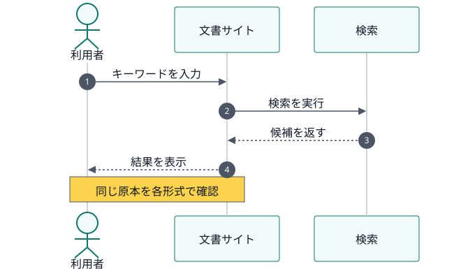

<!-- _class: section -->
<!-- _header: Diagrams｜Mermaid integration -->

# 同じMermaid原本を テーマ準拠で描画する

## MarpはforsteriテーマのSVGを埋め込む

---

<!-- _class: figure-center -->

# フローは判断と戻り経路を一枚で追える

---

<!-- _class: figure-center -->

# シーケンスは利用者から検索までの応答を示す

---

<!-- _class: figure-center -->

# AWS公式アイコンも同じ原本から描画できる

<!--
[Sources]
- https://aws.amazon.com/architecture/icons/
-->

---

<!-- _class: ending -->
<!-- _footer: docs-toolkit v0.1.0 · 2026 -->

# 図は原本を編集し、SVGは再生成する

生成SVGは`diagrams/generated/forsteri/`に置き、直接は編集しません。
