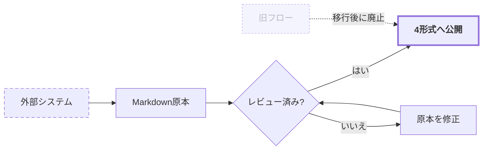
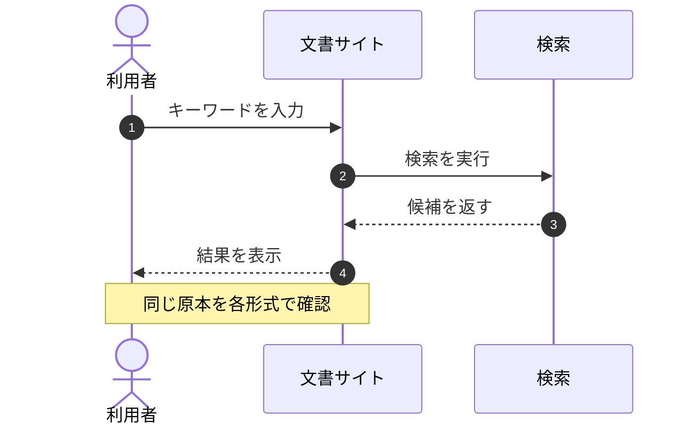

# forsteri Slidev Theme

## データを渡すだけで、統一されたトーンの図になる

レイアウト・スマートアート・プレゼンパターンの回帰確認

---
layout: section
section: Section 1
---

# ブランドと基本レイアウト

## Marpと同じ共有トークンを使う

---

# defaultは見出しと本文の階層を揃える

## 一枚で伝えることを先に決める

- 主色はティール（`--forsteri-primary`）に統一する
- タイトル下は主色1本の細いラインだけを置く
- 図表の系列は系列色8色を順に使う

| 用途 | 選ぶ色 |
|---|---|
| 見出し・リンク・アクセント | 主色 |
| グラフ・図解の系列 | 系列色 1〜8 |
| 淡い面（引用・偶数行） | 主色の淡色 |

---

# 系列色8色は黒文字が載る明度で揃える

  <h2>系列色｜グラフ・表組・図解の色分け</h2>
  

    
<strong>Series 1</strong>#5EEAD4

    
<strong>Series 2</strong>#FCD34D

    
<strong>Series 3</strong>#A5B4FC

    
<strong>Series 4</strong>#F9A8D4

    
<strong>Series 5</strong>#BEF264

    
<strong>Series 6</strong>#7DD3FC

    
<strong>Series 7</strong>#D6D3D1

    
<strong>Series 8</strong>#94A3B8

  

  <h2>主色｜見出し・リンク・表ヘッダ</h2>
  

    
<strong>Primary</strong>#0F766E

    
<strong>Primary strong</strong>#115E59

    
<strong>Ink</strong>#111827

    
<strong>Gray 700</strong>#4B5563

  

---
layout: statement
---

# 色は選択肢ではなく、テーマの既定動作にする

利用側が色値を指定しなくても、目的に合うトークンが自動で割り当てられます。

---
layout: metric
---

# 単一KPIは視線を分散させない

  
87%

  
サンプル指標の達成率

  
目標比 +7pt

---
layout: section
section: Section 2
---

# スマートアート

## propsへ配列・オブジェクトを渡して描画する

---

# Processは順序と各工程の役割を示す

<Process :items='[
  {"title":"整理","detail":"対象と前提を揃える"},
  {"title":"設計","detail":"判断基準を決める"},
  {"title":"検証","detail":"小さく試す"},
  {"title":"展開","detail":"結果を反映する"}
]' />

---

# Cycleは反復と学習の流れを示す

<Cycle center="継続改善" :items='[
  {"title":"計画","detail":"仮説を置く"},
  {"title":"実行","detail":"試行する"},
  {"title":"確認","detail":"差を測る"},
  {"title":"改善","detail":"次へ反映"}
]' />

---

# Pyramidは上位概念から実行単位までをつなぐ

<Pyramid :levels='[
  {"title":"Purpose","detail":"提供する価値"},
  {"title":"Strategy","detail":"優先する方針"},
  {"title":"Initiatives","detail":"実行する施策"},
  {"title":"Actions","detail":"日々の行動"}
]' />

---

# Matrix2x2は優先順位の判断を揃える

<Matrix2x2 x-label="実行難度 →" y-label="効果 →" :quadrants='[
  {"title":"育成","detail":"効果は高いが準備が必要"},
  {"title":"重点投資","detail":"効果と実現性が高い"},
  {"title":"保留","detail":"前提の再検証が必要"},
  {"title":"クイックウィン","detail":"すぐに着手できる"}
]' />

---

# Funnelは各段階の残存数を見せる

<Funnel :stages='[
  {"title":"対象","value":"1,200"},
  {"title":"関心","value":"640"},
  {"title":"検討","value":"280"},
  {"title":"採用","value":"95"}
]' />

---

# KpiCardsは同じ粒度の指標を比較する

<KpiCards :items='[
  {"label":"進捗率","value":"76%","delta":"計画比 +4pt","note":"8月末時点"},
  {"label":"完了件数","value":"38","delta":"前月 +9","note":"累計"},
  {"label":"重大リスク","value":"2","delta":"前月 -1","note":"対策実行中"}
]' />

---

# Roadmapは四半期と担当領域を交差させる

<Roadmap :lanes='[
  {"name":"製品","items":[{"quarter":"Q1","title":"要件"},{"quarter":"Q2","title":"試行"},{"quarter":"Q3","title":"正式版"}]},
  {"name":"運用","items":[{"quarter":"Q2","title":"手順設計"},{"quarter":"Q3","title":"教育"},{"quarter":"Q4","title":"定着化"}]},
  {"name":"評価","items":[{"quarter":"Q1","title":"基準定義"},{"quarter":"Q4","title":"効果測定"}]}
]' />

---

# Comparisonは対比する観点を左右で揃える

<Comparison
  :left='{"title":"現状","summary":"個別最適の運用","items":["入力形式が異なる","判断が属人化","引継ぎに時間がかかる"]}'
  :right='{"title":"将来","summary":"共通ルールで運用","items":["入力形式を統一","判断基準を共有","履歴から再利用"]}'
/>

---

# 系列色は8色を超えると先頭から循環する

<Process :items='[
  {"title":"1","detail":"series-1"},
  {"title":"2","detail":"series-2"},
  {"title":"3","detail":"series-3"},
  {"title":"4","detail":"series-4"},
  {"title":"5","detail":"series-5"},
  {"title":"6","detail":"series-6"},
  {"title":"7","detail":"series-7"},
  {"title":"8","detail":"series-8"}
]' />

---
layout: section
section: Section 3
---

# Mermaid図解も同じトークンで描く

## 原本はMarkdownへ置き、色はテーマに任せる

---

# フローは判断と戻り経路を一枚で追える

<!-- diagrams:flowchart:start -->

<!-- diagrams:flowchart:end -->

---

# シーケンスは利用者から検索までの応答を示す

<!-- diagrams:sequence:start -->

<!-- diagrams:sequence:end -->

---

# AWS公式アイコンもMermaid内で選べる

<!-- diagrams:architecture-aws:start -->

<!-- diagrams:architecture-aws:end -->

<!--
[Sources]
- https://aws.amazon.com/architecture/icons/
-->

---
layout: section
section: Section 4
---

# ダーク表示

## `class: dark`でNightパレットへ切り替える

---
class: dark
---

# ダーク表示はカジュアル資料向けのオプトイン

## 勉強会メモやライブデモで選ぶ。通常資料の既定にはしない

<KpiCards :items='[
  {"label":"Build","value":"42s","delta":"前回比 -8s"},
  {"label":"Checks","value":"18","delta":"すべて成功"}
]' />

---
layout: cover
class: dark
kicker: Dark cover
---

# ダーク表紙も同じトークンで組む

## Nightパレットの面と主色系アクセント

---
layout: ending
---

# forsteri Slidev Theme

## 質問・改善提案は docs-toolkit のリポジトリへ

回帰確認はこのショーケースを `npm run check` で通す
